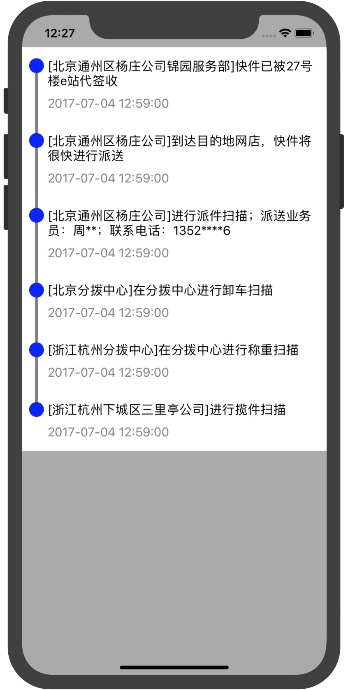

# WMTimeLineView

# 项目展示

## 物流时间轴显示
由于项目的需求，所以自己用Swift实现了一个时间轴的小demo,可以方便大家二次修改使用。

1. 采用snpkit 实现

2. 可以方便二次开发

# 使用方法：
1. 把WMTimeLineView拉入项目

2. 复制Viewcontroller到项目中

3. 自定义的model类要实现WMTimeLineModelProtocol协议
